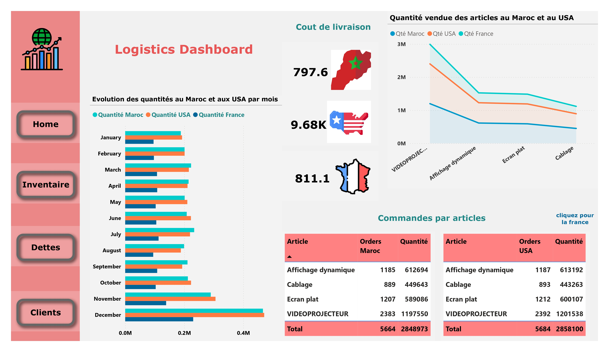
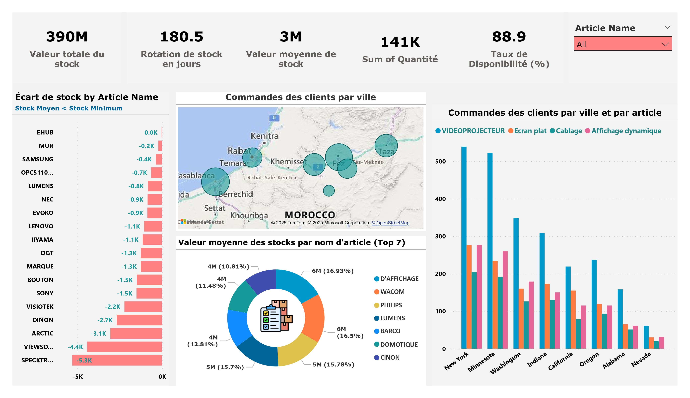

# Logistics-Dashboard-PowerBI

**Interactive Power BI dashboard** built from **Excel and PDF data** to monitor logistics performance, tracking **orders, stock levels, fulfillment metrics, and client demand trends** across regions.

---

## 📌 Objective
To provide a consolidated analytical view of logistics operations, enabling region-wise monitoring of order volumes, inventory availability, and client demand patterns.

---

## 📂 Data Source
- Excel files containing logistics data divided into **three structured sheets**
- PDF reports integrated into the analysis  
- Source data was originally in **French**, requiring interpretation and standardization before analysis

---

## 📊 Key Metrics Analyzed
- Order volume trends  
- Inventory levels and stock movement  
- Fulfillment rates  
- Regional client demand patterns  

---

## 🚀 Impact
- Enabled **region-wise visibility** into logistics and inventory performance  
- Identified **demand–supply gaps** through order and stock trend analysis  
- Supported better **inventory planning and regional distribution decisions**

---

## 🛠 Tools Used
- **Power BI**  
- **Microsoft Excel**  
- **PDF data extraction**

---

## 📸 Dashboard Preview

---
